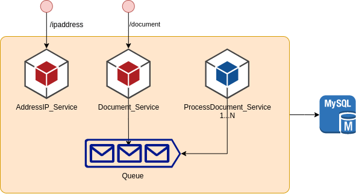

# APPGATE

## Challenge - Carga archivo y consulta de informacion

AppGateChallenge es una aplicacion codificada en JAVA utilizando el framework SPRING BOOT, este se compone de un set de servicios rest los cuales proveen la funcionalidad para la carga de una archivo CSV con un formato especifico luego de cargarlo se ejecuta un procesamiento del archivo utilizando ThreadPool para optimizar el uso de memoria y paralelismo de la funcionalidad, ya cargda la base de datos existe un servicio para consultar una ip, convertirla en formato decimal y realizar una consulta para conocer a que paiz, region y ciudad pertenece. 

El siguiente diagrama visualiza una arquitectura de alta disponibilidad y eficiencia basada en microservicios y encolamiento para el procesamiento de los archivos de forma paralela



### Características

* Cargar un archivo
* Dividir el archivo en archivos de 3Megas (Microarchivo)
* Cargar la informacion de cada microarchivo en forma paralela
* Consultar los archivos cargados y en que estado de procesamiento se encuentra
* Optimizar el modelo de datos para que no exista duplicidad de informacion
* Consultar una ip y conocer a que ciudad,region y pais pertenece


## Primeros pasos

### Requisitos ###

Para el correcto funcionamiento se requiere

* Mysql 5.7
* Java 11
* Maven


### Instalación

El componente puede ser utilizado de dos formas diferentes, las cuales requieren realizar un cambio en la configuracion del archivo de propiedades de spring

***Spring boot***

Realizar la configuracion de conexion a la base de datos mysql en el archivo *application.properties*. Para esto es necesario cambiar los valores estaticos como lo serian la ip y puerto del servico mysql, el nombre de la base de datos, el usuario de conexion a la base de datos y la contraseña, tambien puede crear la variables de entorno en el sistema opertivo para que el aplicatio las configure dinamiecamente. (Los datos que se vizualizan son de ejemplo)

```	
  datasource:
        driver-class-name: com.mysql.cj.jdbc.Driver
        url: jdbc:mysql://${MYSQL_URL:10.10.10.10:3306}/${MYSQL_DATABASE:Appgate}
        username: ${MYSQL_USER:Appgate}
        password: ${MYSQL_PASSWORD:Appgate123&*}
```

Una vez realizada la configuracion en el archivo se realiza la compilacion desde el directorio raiz del proyecto ejecutando el comando

```
mvn clean install
```

Una vez finalizado el proceso de compilacion con exito, ejecutamos el siguiente comando para iniciar el componente

```
java -jar target/appgate-challenge-0.0.1-SNAPSHOT.jar
```


***Docker Container***

Realizar la validacion que en el archivo *application.properties* esten configuradas las variables para la conexion a base de datos y permita la configuracion por medio de variables de entrono

```spring.data.mongodb.host= ${MONGO_SERVER}
  datasource:
        driver-class-name: com.mysql.cj.jdbc.Driver
        url: jdbc:mysql://${MYSQL_URL:10.10.10.10:3306}/${MYSQL_DATABASE:Appgate}
        username: ${MYSQL_USER:Appgate}
        password: ${MYSQL_PASSWORD:Appgate123&*}
```

Una vez realizada la configuracion en el archivo se realiza la compilacion desde el directorio raiz del proyecto ejecutando el comando

```
mvn clean install
```

Una vez finalizado el proceso de compilacion con exito, crearemos la imagen docker utilizando el siguiente comando

```
docker build -t lamaichel/appgatechallenge .
```

Para iniciar el contenedor primero debemos crear un archivo de variables de entorno el cual puede llamarse .env_appgate y debe contener la siguiente informacion

```
MYSQL_URL=10.10.10.10:3306
MYSQL_USER=Appgate
MYSQL_DATABASE=Appgate
MYSQL_PASSWORD=Appgate123&*
```

Para concluir ejecutaremos el siguiente comando que nos permite iniciar el docker utilizando las variables de entorno

```
docker run --name appgate_challenge --env-file=.env_appgate -p 8080:8080 -d lamaichel/appgatechallenge
```


***Docker Compose***

Para efectos practicos se incluye un archivo docker-compose en el cual se realiza la configuracion de la base de datos y la configuracion de la aplicacion, para poder utilizarlo es necesario realizar la compilacion del codigo y la creacion del contenedor

Compilacion del codigo

```
mvn clean install
```

Creacion del compilacion

```
docker build -t lamaichel/appgatechallenge .
```

Ejecucion docker compose

```
docker-compose up
```


### Validacion y documentacion

Podemos validar el funcionamiento del componente accediendo a la url 

```
OpenApi Definition: http://localhost:8080/v3/api-docs/
OpenApi UI:			http://localhost:8080/swagger-ui.html
```

Tambien dentro del repositorio de codigo se puede encontrar una carpeta que se llama docs donde se pueden encontrar la siguiente informacion

* Docker: Comandos necesarios para la ejecucion manual de compilacion y ejecicion en docker
* Postman_collection: Proyecto ejemplo para el consumo de servicios


## Control de versiones

| Fecha         | Version | Descripcion | Autor |
| ----- | ------- | ----------- | ----- |
| 21 Junio 2021 | 1.0     | Generacion del componente y documentacion | Alejandro Rodriguez Maichel |
|               |         |             |       |
|               |         |             |       |


